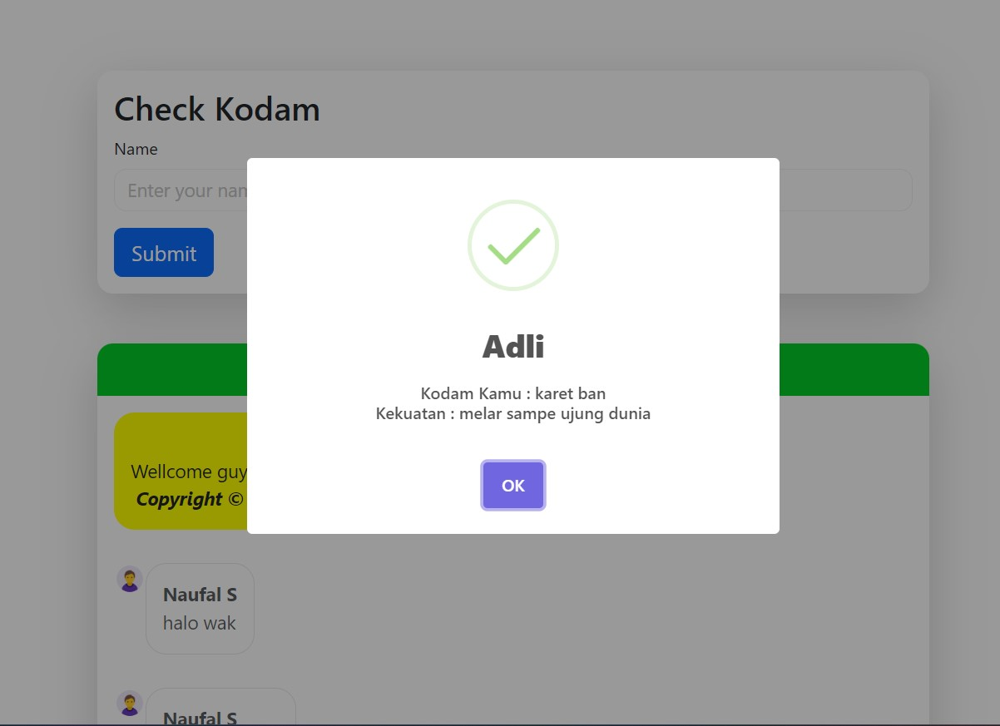
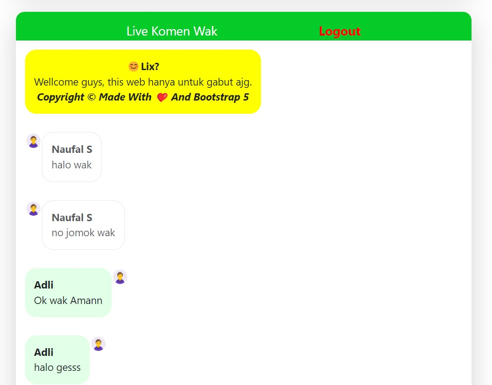
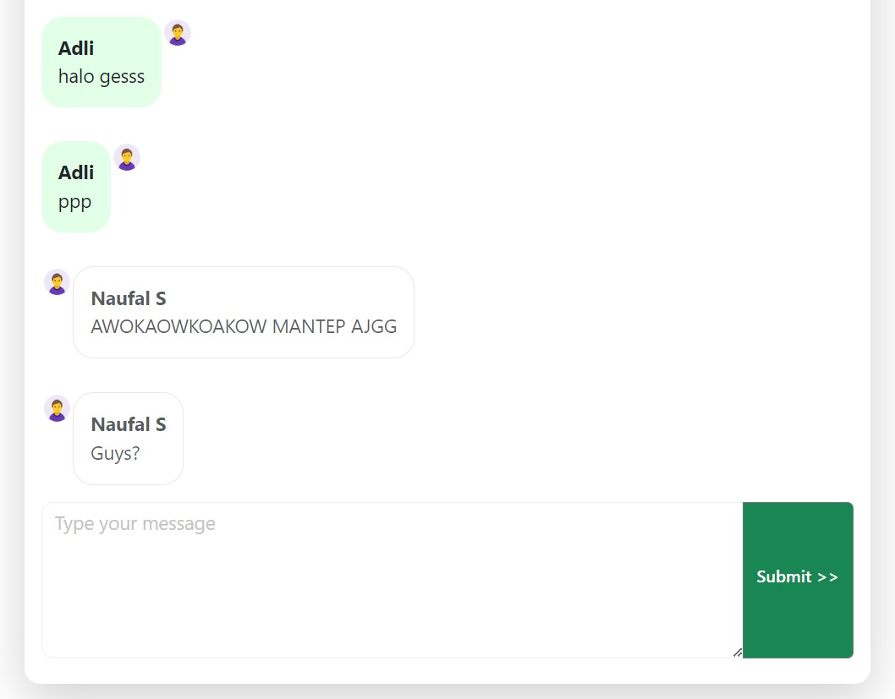

<p align="center">
    <br>
    <br>
    
</p>

# Website Cek Kodam dengan fitur Live Chat menggunakan Login
> pertama saya ucapkan terima kasih kepada kalian yang mau mampir, tidak tertinggal trend yang lagi viral ya itu trend cek kodam, di sini saya bermaksud membuat website cek kodam beserta fitur live chat.


## Setting dan cara penggunaan Web Cek Kodam
sebelumnya kamu harus sudah terinstall xampp di device kamu, kemudian ambil project dari github saya

1. [Fork](https://github.com/AdliXSec/CekKodamWithLiveChat) the project

```sh
# Clone
git clone https://github.com/AdliXSec/CekKodamWithLiveChat
```
2. Atur database di file config.php dan upload file sql di folder database bernama livekodam.sql ke phpmyadmin

```php
<?php
$db = new mysqli("localhost", "root", "", "livekodam");

// Cek koneksi
if ($db->connect_error) {
    die("Koneksi gagal: " . $db->connect_error);
}

?>
```
File  SQL
```sql
-- phpMyAdmin SQL Dump
-- version 5.2.1
-- https://www.phpmyadmin.net/
--
-- Host: 127.0.0.1
-- Generation Time: Jul 15, 2024 at 09:02 PM
-- Server version: 10.4.28-MariaDB
-- PHP Version: 8.2.4

SET SQL_MODE = "NO_AUTO_VALUE_ON_ZERO";
START TRANSACTION;
SET time_zone = "+00:00";


/*!40101 SET @OLD_CHARACTER_SET_CLIENT=@@CHARACTER_SET_CLIENT */;
/*!40101 SET @OLD_CHARACTER_SET_RESULTS=@@CHARACTER_SET_RESULTS */;
/*!40101 SET @OLD_COLLATION_CONNECTION=@@COLLATION_CONNECTION */;
/*!40101 SET NAMES utf8mb4 */;

--
-- Database: `livekodam`
--

-- --------------------------------------------------------

--
-- Table structure for table `chat`
--

CREATE TABLE `chat` (
  `id_cht` int(11) NOT NULL,
  `nama_cht` varchar(500) NOT NULL,
  `email_cht` varchar(500) NOT NULL,
  `isi_cht` text NOT NULL,
  `gender_cht` varchar(500) NOT NULL
) ENGINE=InnoDB DEFAULT CHARSET=utf8mb4 COLLATE=utf8mb4_general_ci;

--
-- Dumping data for table `chat`
--

INSERT INTO `chat` (`id_cht`, `nama_cht`, `email_cht`, `isi_cht`, `gender_cht`) VALUES
(2, 'Naufal S', 'naufalsyahruradli@gmail.com', 'halo wak', 'male'),
(3, 'Naufal S', 'naufalsyahruradli@gmail.com', 'no jomok wak', 'male'),
(4, 'Adli', 'adli@gmail.com', 'Ok wak Amann', 'male'),
(5, 'Adli', 'adli@gmail.com', 'halo gesss', 'male'),
(6, 'Adli', 'adli@gmail.com', 'ppp\r\n', 'male'),
(7, 'Naufal S', 'naufalsyahruradli@gmail.com', 'AWOKAOWKOAKOW MANTEP AJGG', 'male'),
(8, 'Naufal S', 'naufalsyahruradli@gmail.com', 'Guys?', 'male');

-- --------------------------------------------------------

--
-- Table structure for table `user`
--

CREATE TABLE `user` (
  `id_kdm` int(11) NOT NULL,
  `username_kdm` varchar(500) NOT NULL,
  `email_kdm` varchar(500) NOT NULL,
  `password_kdm` varchar(500) NOT NULL,
  `gender_kdm` varchar(500) NOT NULL
) ENGINE=InnoDB DEFAULT CHARSET=utf8mb4 COLLATE=utf8mb4_general_ci;

--
-- Dumping data for table `user`
--

INSERT INTO `user` (`id_kdm`, `username_kdm`, `email_kdm`, `password_kdm`, `gender_kdm`) VALUES
(1, 'Naufal S', 'naufalsyahruradli@gmail.com', '933f1441b6a98f7f2bd3f2bef5d0b533', 'male'),
(2, 'Adli', 'adli@gmail.com', '933f1441b6a98f7f2bd3f2bef5d0b533', 'male');

--
-- Indexes for dumped tables
--

--
-- Indexes for table `chat`
--
ALTER TABLE `chat`
  ADD PRIMARY KEY (`id_cht`);

--
-- Indexes for table `user`
--
ALTER TABLE `user`
  ADD PRIMARY KEY (`id_kdm`);

--
-- AUTO_INCREMENT for dumped tables
--

--
-- AUTO_INCREMENT for table `chat`
--
ALTER TABLE `chat`
  MODIFY `id_cht` int(11) NOT NULL AUTO_INCREMENT, AUTO_INCREMENT=9;

--
-- AUTO_INCREMENT for table `user`
--
ALTER TABLE `user`
  MODIFY `id_kdm` int(11) NOT NULL AUTO_INCREMENT, AUTO_INCREMENT=3;
COMMIT;

/*!40101 SET CHARACTER_SET_CLIENT=@OLD_CHARACTER_SET_CLIENT */;
/*!40101 SET CHARACTER_SET_RESULTS=@OLD_CHARACTER_SET_RESULTS */;
/*!40101 SET COLLATION_CONNECTION=@OLD_COLLATION_CONNECTION */;

```

3. Sebelum website di jalankan pastikan semua sudah teratur dengan benar kemudian jalankan website, maka tampilan akan seperti ini

<p align="center">
    <br>
    <br>
    
</p>

>Sekian dari saya tanpa banyak basa basi lagi sekian dan terima kasih. Jika  Terdapat error silahkan hubungi sosial media saya yang tercantum